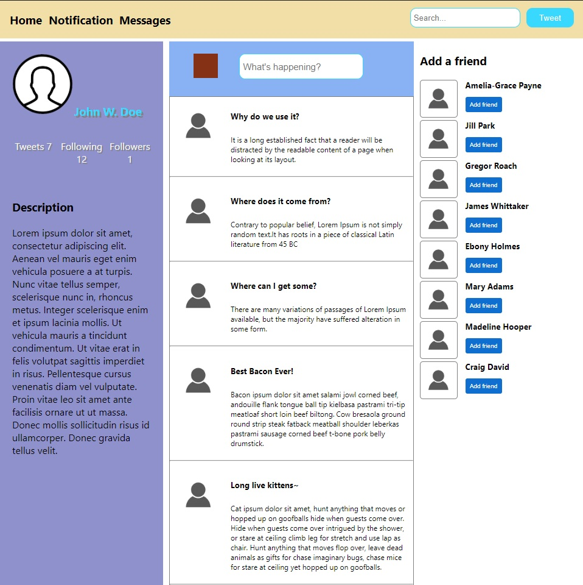
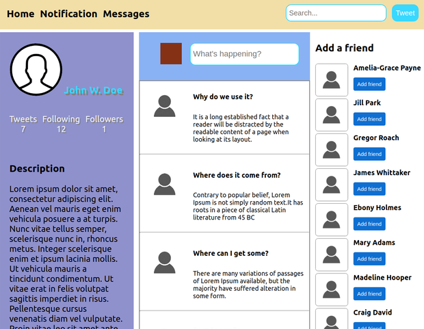
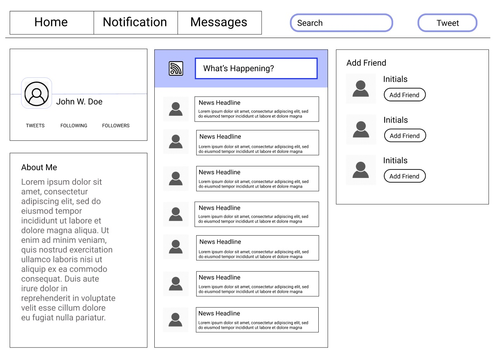
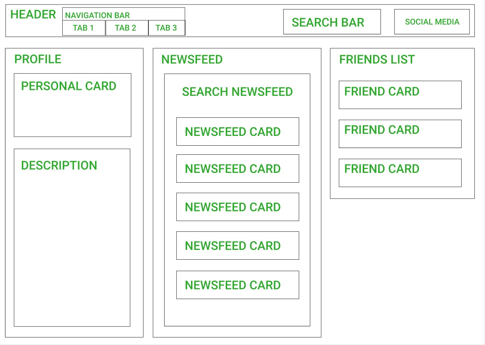

# Social Media Clone

#### React Fundamentals Exercise for [Epicodus](https://www.epicodus.com/), 04.20.2020

#### By **Adela Darmansyah and Andriy Vereymyeyev**

[About](#About) | [Screenshots](#Screenshots) | [Bugs](#Known-Bugs) | [Technologies](#Technologies-Used) | [Contact](#Support-and-Contact-Details)

   

## About

This is a web application to practice React fundamental concepts.

## Screenshots

Maximized window view:

Minimized window view:

## React Component Diagram

Sample layout:

Component Diagram:

## Known Bugs

No known bugs at this time.

## Technologies Used

* HTML
* CSS
* JavaScript
* React
* Figma

## Support and Contact Details

Feel free to provide feedback via email: adela.yohana@gmail.com and belyybrat@gmail.com.

### License

This application is licensed under the MIT license.

Copyright (c) 2020 **Adela Darmansyah, Andriy Vereymyeyev**
